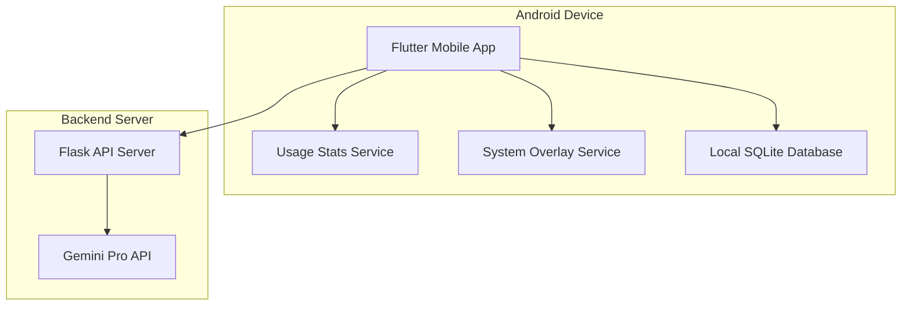
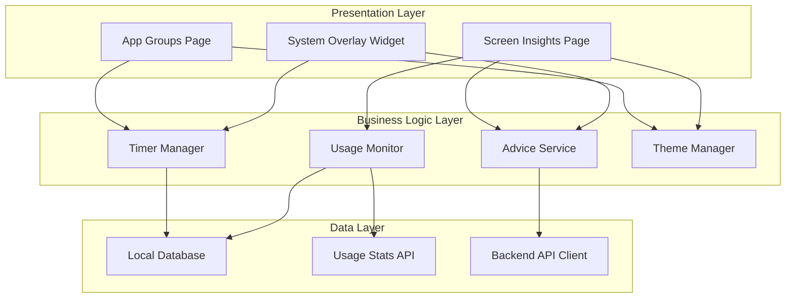

# Design Document

## Overview

The Screen Time Manager is a Flutter-based Android application with a Flask backend that helps users control their digital habits through intelligent app group management, shared timers, and AI-powered insights. The system consists of a mobile frontend that monitors app usage and displays system overlays, and a lightweight backend that generates personalized advice using Google's Gemini Pro API.

## Architecture

### High-Level Architecture



### Mobile App Architecture



## Components and Interfaces

### Mobile App Components

#### 1. Timer Manager
- **Purpose**: Manages shared timers for app groups
- **Key Methods**:
  - `startTimer(groupId: String)`: Starts timer when group app is opened
  - `pauseTimer(groupId: String)`: Pauses timer when leaving group apps
  - `checkTimeLimit(groupId: String): bool`: Checks if time limit exceeded
  - `getRemainingTime(groupId: String): Duration`: Gets remaining time for group

#### 2. Usage Monitor
- **Purpose**: Tracks app usage and detects when target apps are opened
- **Key Methods**:
  - `getCurrentApp(): String`: Gets currently active app
  - `isAppInGroup(appPackage: String, groupId: String): bool`: Checks group membership
  - `startMonitoring()`: Begins background monitoring
  - `getUsageStats(period: TimePeriod): UsageData`: Retrieves usage statistics

#### 3. System Overlay Service
- **Purpose**: Displays reminder overlays over other apps
- **Key Methods**:
  - `showReminder(advice: String, groupId: String)`: Displays overlay with advice
  - `requestOverlayPermission()`: Requests system overlay permission
  - `hasOverlayPermission(): bool`: Checks permission status

#### 4. Advice Service
- **Purpose**: Handles communication with Flask backend for AI advice
- **Key Methods**:
  - `getAdvice(context: AdviceContext): Future<String>`: Requests personalized advice
  - `getFallbackAdvice(duration: Duration): String`: Returns default advice

### Backend Components

#### 1. Flask API Server
- **Endpoints**:
  - `POST /api/advice`: Generates personalized advice
  - `GET /api/health`: Health check endpoint
- **Key Features**:
  - Request validation and sanitization
  - Rate limiting to prevent API abuse
  - Error handling with fallback responses

#### 2. Gemini Integration Service
- **Purpose**: Interfaces with Google's Gemini Pro API
- **Key Methods**:
  - `generateAdvice(prompt: String): String`: Calls Gemini API
  - `buildPrompt(context: AdviceContext): String`: Creates contextual prompts
  - `handleApiError(error: Exception): String`: Manages API failures

## Data Models

### Mobile App Models

```dart
class AppGroup {
  String id;
  String name;
  List<String> appPackages;
  Duration timeLimit;
  DateTime createdAt;
  bool isActive;
}

class TimerSession {
  String groupId;
  DateTime startTime;
  Duration elapsedTime;
  bool isActive;
  DateTime lastPauseTime;
}

class UsageStats {
  String appPackage;
  String groupId;
  Duration dailyUsage;
  Duration weeklyUsage;
  Duration monthlyUsage;
  DateTime lastUsed;
}

class AdviceContext {
  Duration usageDuration;
  String timeOfDay;
  List<String> appCategories;
  String userMood; // optional
}
```

### Backend Models

```python
class AdviceRequest:
    usage_duration: int  # in minutes
    time_of_day: str     # morning, afternoon, evening, night
    app_categories: List[str]
    user_context: Optional[str]

class AdviceResponse:
    advice: str
    success: bool
    fallback_used: bool
```

## Error Handling

### Mobile App Error Handling

1. **Permission Errors**:
   - Usage stats permission denied → Show setup guide
   - Overlay permission denied → Explain limitations and guide to settings

2. **Network Errors**:
   - Backend unreachable → Use fallback advice templates
   - Timeout errors → Retry with exponential backoff

3. **System Errors**:
   - App crash during monitoring → Restart monitoring service
   - Database errors → Attempt recovery and notify user

### Backend Error Handling

1. **API Errors**:
   - Gemini API rate limit → Return cached response or fallback
   - API key invalid → Log error and use fallback advice
   - Network timeout → Retry once, then fallback

2. **Request Errors**:
   - Invalid request format → Return 400 with error message
   - Missing required fields → Return validation error

## Testing Strategy

### Mobile App Testing

1. **Unit Tests**:
   - Timer logic accuracy
   - Usage calculation correctness
   - Advice service response handling
   - Data model validation

2. **Integration Tests**:
   - System overlay display
   - Usage stats API integration
   - Backend API communication
   - Database operations

3. **Widget Tests**:
   - App group creation flow
   - Screen insights display
   - Theme consistency
   - Navigation behavior

4. **End-to-End Tests**:
   - Complete timer workflow
   - Overlay trigger scenarios
   - Permission request flows

### Backend Testing

1. **Unit Tests**:
   - Advice generation logic
   - Request validation
   - Error handling scenarios
   - Gemini API integration

2. **Integration Tests**:
   - API endpoint functionality
   - Database operations
   - External API communication

3. **Load Tests**:
   - Concurrent request handling
   - Rate limiting effectiveness
   - Memory usage under load

## UI/UX Design Specifications

### Theme Configuration

```dart
class AppTheme {
  static const Color primaryPurple = Color(0xFF9146FF); // Twitch purple
  static const Color lightPurple = Color(0xFFB19CD9);
  static const Color darkPurple = Color(0xFF6441A4);
  static const Color backgroundColor = Color(0xFFFAFAFA);
  static const Color cardBackground = Colors.white;
  static const Color textPrimary = Color(0xFF1F1F23);
  static const Color textSecondary = Color(0xFF53535F);
}
```

### Page Layouts

1. **App Groups Page**:
   - Floating action button for creating new groups
   - Card-based layout for existing groups
   - Timer status indicators
   - Quick edit/delete actions

2. **Screen Insights Page**:
   - Tab-based navigation (Daily/Weekly/Monthly)
   - Chart visualizations for usage data
   - AI-generated insights cards
   - Progress indicators and achievements

3. **System Overlay**:
   - Semi-transparent background
   - Centered advice card with purple accent
   - Action buttons (Extend, Break, End Session)
   - Dismissal prevention mechanism

## Security Considerations

1. **Data Privacy**:
   - Minimize data sent to backend
   - Local storage encryption for sensitive data
   - User consent for data processing

2. **API Security**:
   - HTTPS-only communication
   - Request rate limiting
   - Input validation and sanitization
   - API key protection in environment variables

3. **Permission Management**:
   - Clear explanation of required permissions
   - Graceful degradation when permissions denied
   - Regular permission status checks

## Performance Optimizations

1. **Mobile App**:
   - Background service optimization
   - Efficient database queries
   - Lazy loading for insights data
   - Memory management for overlay service

2. **Backend**:
   - Response caching for common requests
   - Connection pooling
   - Asynchronous request processing
   - Resource cleanup and monitoring